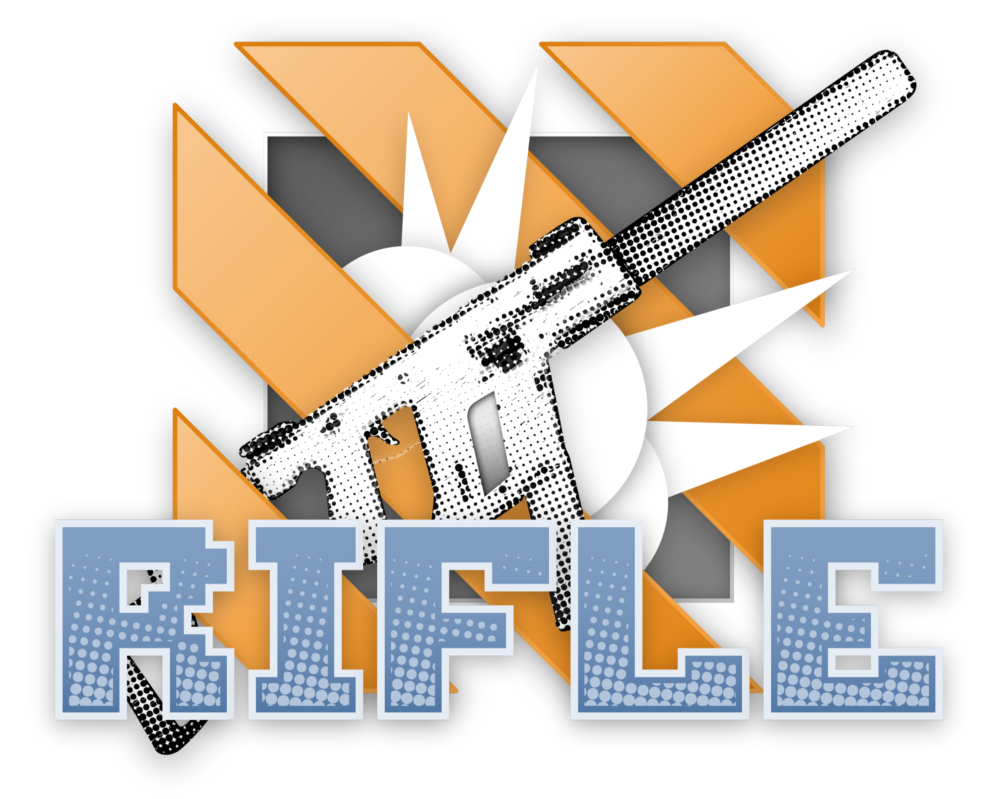

  

    
  

## Project page for the paper:

# RIFLE: Removal of Image Flicker-Banding via Latent Diffusion Enhancement

[LiBo Zhu](https://github.com/LiBoZhu030073), [Zihan Zhou](https://github.com/ZZH-qwq), [Xiaoyang Liu](), [Weihang Zhang](), [Keyu Shi](), [Yifan Fu]() and [Yulun Zhang](http://yulunzhang.com/)  
**"RIFLE: Removal of Image Flicker-Banding via Latent Diffusion Enhancement", arxiv 2025**

---

Page: https://libozhu03.github.io/RIFLE/

Repo: https://github.com/libozhu03/RIFLE/
