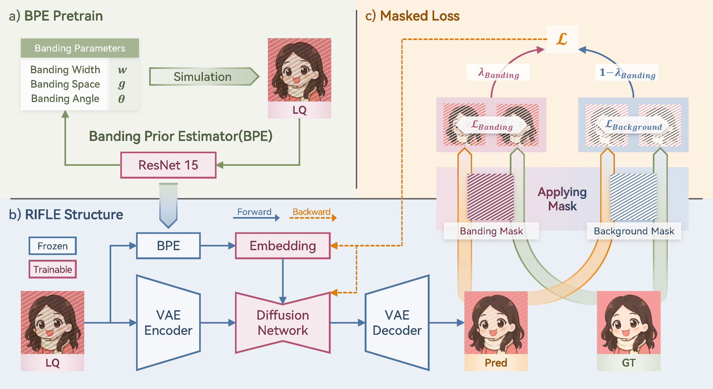

<div align="center">
  <p align="center">
    
  </p>
</div>

# RIFLE: Removal of Image Flicker-Banding via Latent Diffusion Enhancement

[LiBo Zhu](https://github.com/LiBoZhu030073), [Zihan Zhou](), [Xiaoyang Liu](), [Weihang Zhang](), [Keyu Shi](), [Yifan Fu]() and [Yulun Zhang](http://yulunzhang.com/)  
**"RIFLE: Removal of Image Flicker-Banding via Latent Diffusion Enhancement", arxiv 2025**

[](https://labor555.github.io/PassionSR_Web/)
[](https://arxiv.org/abs/2411.17106)
[](https://github.com/user-attachments/files/22590138/compress_arxiv_supp_Libo_Zhu__ICLR_26_Debanding.pdf)
[](https://github.com/libozhu03/RIFLE/releases)
[](https://github.com/libozhu03/RIFLE)
[](https://github.com/libozhu03/RIFLE)

---

## 📚 Table of Contents

- [🔥 News](#-news)
- [📘 Abstract](#-abstract)
- [📝 Structure Overview](#-structure-overview)
- [⚙️ Installation](#️-installation)
- [📥 Download Pretrained Models and Datasets](#-download-pretrained-models-and-datasets)
- [🧪 Inference](#-inference)
- [🔎 Results](#-results)
- [📝 Acknowledgements](#-acknowledgements)
- [📌 Citation](#-citation)

---

## 🔥 News
- **[2025-09-29]** Create repository.

### ⭐⭐⭐ If RIFLE is helpful to your projects, please help star this repo. Thanks!
---

## 📘 Abstract

>  Capturing screens is now routine in our everyday lives. But the photographs of emissive displays are often influenced by the flicker-banding (FB), which is alternating bright–dark stripes that arise from temporal aliasing between a camera’s rolling-shutter readout and the display’s brightness modulation. Unlike moiré degradation, which has been extensively studied, the FB remains underexplored despite its frequent and severe impact on readability and perceived quality. We formulate FB removal as a dedicated restoration task and introduce Removal of Image Flicker-Banding via Latent Diffusion Enhancement, RIFLE, a diffusion-based framework designed to remove FB while preserving fine details. We propose the flicker-banding prior estimator (FPE) that predicts key banding attributes and injects it into the restoration network. Additionally, Masked Loss (ML) is proposed to concentrate supervision on banded regions without sacrificing global fidelity. To overcome data scarcity, we provide a simulation pipeline that synthesizes FB in the luminance domain with stochastic jitter in banding angle, banding spacing, and banding width. Feathered boundaries and sensor noise are also applied for a more realistic simulation. For evaluation, we collect a paired real-world FB dataset with pixel-aligned banding-free references captured via long exposure. Across quantitative metrics and visual comparisons on our real-world dataset, RIFLE consistently outperforms recent image reconstruction baselines from mild to severe flicker-banding. To the best of our knowledge, it is the first work to research the simulation and removal of FB. Our work establishes a great foundation for subsequent research in both the dataset construction and the removal model design.

---

## 📝 Structure Overview
<p align="center">
  
</p>


<p align="center">
  
</p>

|                      RealFlicker                      |                      GT                      |                   LQ                     |            MAT             | InvSR   |            PiSA-SR            |             Step1X          |           RIFLE      |
| :------------------------------------------: | :------------------------------------------: | :---------------------------------------------: | :---------------------------------------------: | :---------------------------------------------: | :---------------------------------------------: |:---------------------------------------------: |:---------------------------------------------: |
|  |  |  |  |  | | | |
|  |  |  |  |  | | | |


</details>

---


## ⚙️ Installation
TBD

---

## 📥 Download Pretrained Models and Datasets
TBD

---

## 🧪 Inference
TBD

---

## <a name="-results"></a> 🔎 Results
RIFLE significantly out-performs previous methods, which are fintuned with our simulated datasets. 


<details>
<summary> 📊 Quantitative comparisons in Table 1 of the main paper (click to expand)</summary>

<p align="center">
  
</p>
</details>

<details>
<summary> 🖼 Visual comparison in Figure 6 of the main paper (click to expand)
</summary>

<p align="center">
  
</p>
</details>

---

## 📝 Acknowledgements
We would like to thank the developers and maintainers of [Stable Diffusion](https://github.com/Stability-AI/StableDiffusion), [Diffusers](https://github.com/huggingface/diffusers), and [PiSA-SR](https://github.com/csslc/PiSA-SR) for their open-source contributions, which have greatly facilitated our research and development.

This project is supported in part by the Shanghai Jiao Tong University Artificial Intelligence Institute.

We also thank our collaborators and contributors for their valuable feedback and technical discussions.

## 📌 Citation

```bibtex

```